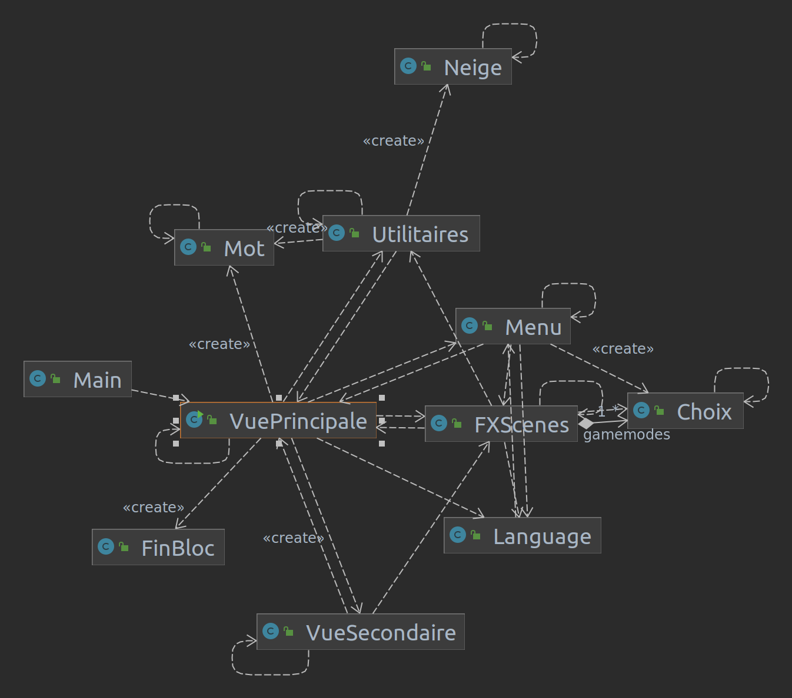

# fastClavier 💻

Bienvenue sur fastClavier, un jeu conçu pour vous aider à améliorer votre vitesse et votre précision de frappe. L'application a deux modes: "normal" et "jeu".

## Prérequis

Pour exécuter fastClavier, vous devez avoir installé les éléments suivants sur votre système:

*   Java 8 ou supérieur
*   JavaFX
*   Maven , pour installer `sudo apt install maven`

## Exécuter l'application
#### Jar
Pour exécuter fastClavier, suivez ces étapes:

1.  Téléchargez la dernière version de l'application depuis la page [releases](https://gaufre.informatique.univ-paris-diderot.fr/makhloum/fast-clavier-/releases).
2.  Extrayez le fichier téléchargé dans un emplacement de votre ordinateur.
3.  Accédez au répertoire extrait dans une fenêtre de terminal.
4.  Exécutez la commande `make run`.

#### Build
1.  Téléchargez la dernière version de repertoire depuis la page [repo](https://gaufre.informatique.univ-paris-diderot.fr/makhloum/fast-clavier-/).
2.  Exécutez la commande `make all`.

## Utilisation de l'application

fastClavier a deux modes: "normal" et "jeu". En mode "normal".
- `Mode Normal` : Il s'agit du mode standard des jeux de dactylographie, dans lequel un texte est généré et vous avez 60 secondes pour écrire le nombre maximum de mots. Le score est la multiplication du nombre de caractères écrits en une minute par la précision.
- `Mode Jeu` : Le deuxième mode est plus difficile, dans lequel le temps est infini mais vous avez des vies. Les mots commenceront à arriver comme dans un jeu de tétris et après avoir écrit 50 mots, vous passerez au niveau suivant qui apporte plus de mots à une vitesse plus élevée. Le joueur perd un cœur s'il a manqué un mot et le score final est le niveau atteint par le joueur. 

Pour basculer entre les modes, utilisez le menu déroulant dans le coin supérieur droit de l'application. Dans le menu de l'application, vous pouvez choisir l'un des éléments suivants. fastClavier prend en charge l'anglais et le français comme langues de frappe, ce paramètre peut être sélectionné après avoir choisi le mode

## Classes de l'application

Voici un aperçu des classes principales de l'application:
#### Package Application
*   `Main`: Il s'agit de la classe principale qui a pour seule tâche d'initier et de démarrer l'application en appelant la méthode **launcher** de la **VuePrincipale**.
*   `VuePrincipale`: Cette classe est celle qui change entre les différentes scènes des jeux et possède la logique des deux modes de jeu. 
*   `VueSecondaire`: La seconde vue est une classe complémentaire à la première qui contient quelques aspects supplémentaires qui ne sont pas partagés entre les deux modes. Nous avons donc choisi de la séparer.
*   `FXScenes`: Comme son nom l'indique, cette classe contient différentes méthodes dont chacune sera chargée de définir les éléments de la scène du jeu.
*   `Utilitaires`: Cette classe contient quelques fonctions utilitaires utilisées dans différentes classes.

#### Package Application.composants
*   `Choix`: Cette classe a la logique pour les choix dans les jeux qui sont deux le gamemode et les langues, il contrôle quand choisi et appelle la méthode appropriée en plus de l'animation du choix et le changement.
*   `FinBloc`: Celui-ci contient la définition et le comportement des éléments utilisés dans la scène GameOver.
*   `Language`: Cette classe est responsable du chargement des mots à partir des fichiers après avoir sélectionné une langue.  
*   `Menu`: Le menu est la classe qui contrôle à la fois la sélection des langues et le mode de jeu en initiant la scène et en affichant les choix.
*   `Mot`: Cette classe est spéciale pour le mode de jeu, elle contient la création et les animations des mots.
*   `Neige`: Il contient l'initiation et l'animation des particules présentes dans le fond du jeu, pas toutes mais juste la neige et son mouvement.

Le diagramme suivant reprend les classes et leurs interconnexions

#### Package Application.Fonts
- Grixel Kyrou 7 Wide Bold
- Courier New
- Courier New Bold

## Dépannage

Si vous rencontrez des problèmes lors de l'exécution de fastClavier, consultez le [guide de dépannage](https://gaufre.informatique.univ-paris-diderot.fr/makhloum/fast-clavier-/wiki/Troubleshooting) sur le wiki. Si vous ne parvenez pas à trouver une solution à votre problème, ouvrez une [issue](https://gaufre.informatique.univ-paris-diderot.fr/makhloum/fast-clavier-/issues) sur le suivi des problèmes.
